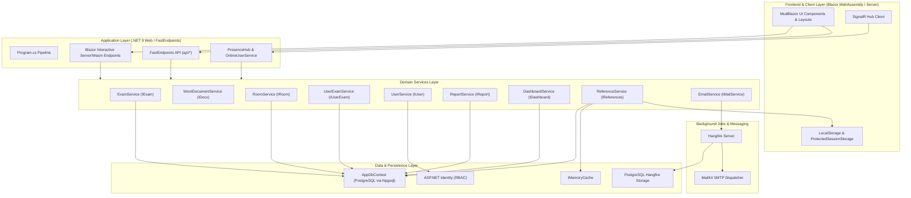
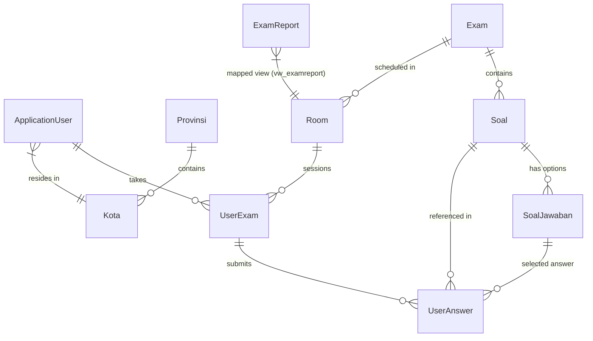
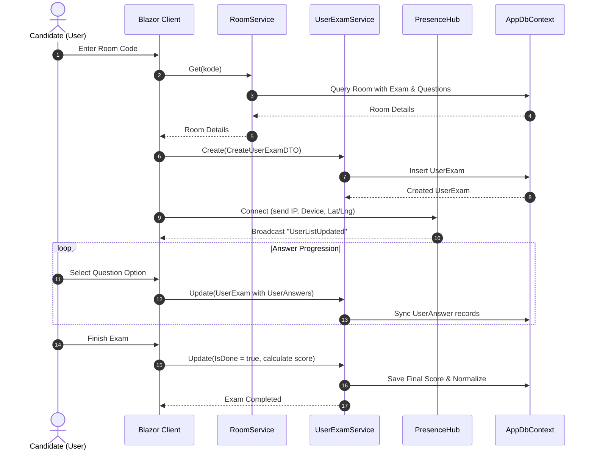
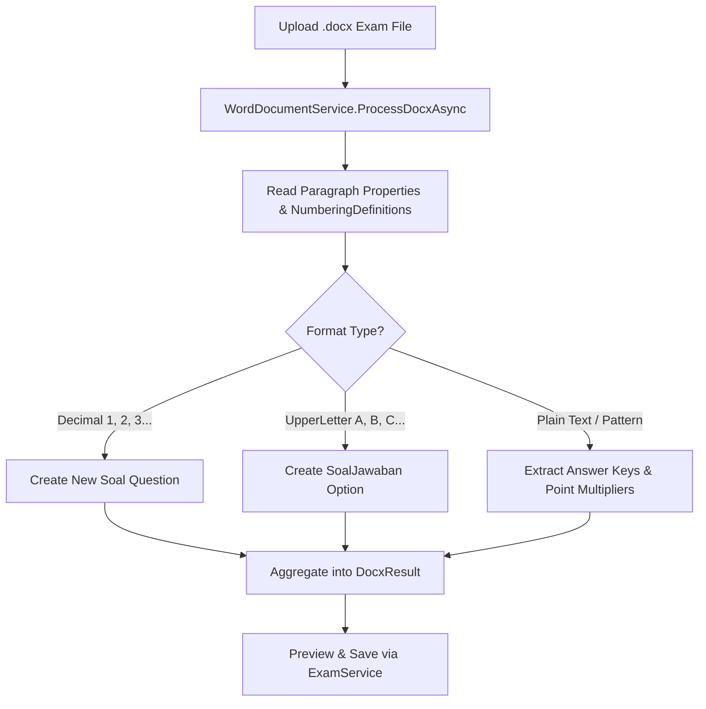

# Project Examination - Design System & Architecture Specification

## 1. High-Level System Architecture

The application is built on **.NET 9** utilizing a hybrid **Blazor Interactive Server & WebAssembly** architecture with **FastEndpoints** for HTTP API routes, **SignalR** for real-time presence telemetry, **EF Core** with **PostgreSQL** for persistence, and **Hangfire** for asynchronous background job execution.

---

## 2. Domain Data Model & Entity Relations

The persistence architecture is managed by `AppDbContext` with PostgreSQL:

### Core Entities Summary
1. **`ApplicationUser`**: Extended ASP.NET Identity user storing full name, gender, phone number, photo, occupation, last login timestamp, and foreign key to `Kota`.
2. **`Exam`**: The test blueprint/exam collection containing a name, description, duration, and question collection.
3. **`Soal` & `SoalJawaban`**: Question bank items supporting single-choice or multiple-choice weighted point systems (`isMultipleJawaban`, points per option).
4. **`Room`**: Test room instance with a unique entry code (`Kode`), schedule window (`JadwalStart` to `JadwalEnd`), and assigned `Exam`.
5. **`UserExam`**: An individual candidate's exam session tracking start/end times, remaining time (`TimeLeft`), retry counts, normalized score calculation, and status flags (`IsOngoing`, `IsDone`).
6. **`UserAnswer`**: Candidate answers mapping `UserExam` to individual `Soal` and selected `SoalJawaban`.
7. **`ExamReport`**: Database view (`vw_examreport`) providing flattened query capabilities for reporting.

---

## 3. Service Layer Architecture & Responsibilities

| Service & Interface | Primary Responsibilities | Dependencies & Key Features |
| :--- | :--- | :--- |
| **`ExamService`** (`IExam`) | Manages question bank and exam sets. | - CRUD operations with eager loading of questions and answers. - Differential synchronization (`Except`) for questions and options on update. - Pagination with `WhereIf` filtering. |
| **`WordDocumentService`** (`IDocx`) | Ingests `.docx` files to parse questions and answer choices automatically. | - Uses `DocumentFormat.OpenXml`. - Regex-based answer key & point parsing. - Auto-detects decimal numbering (questions) and letter lists (options). |
| **`RoomService`** (`IRoom`) | Coordinates exam rooms, join tokens, and supervisor views. | - Generates and validates unique room codes (`Kode`). - Scopes room management to current user/creator. - Splits queries for efficient nested loads. |
| **`UserExamService`** (`IUserExam`) | Handles exam attempt lifecycle, submission, and grading. | - Prevents duplicate room entry. - Calculates normalized scores and score histories. - Synchronizes nested child collections (`UserAnswer`). |
| **`UserService`** (`IUser`) | Manages user registration, profiles, authentication, and RBAC. | - ASP.NET Identity integration. - Roles: `Superuser`, `Operator`, `Dosen`, `User`. - Password reset workflows and activation overrides. |
| **`ReportService`** (`IReport`) | Provides aggregated exam results and analytical outputs. | - Leverages database view `vw_examreport`. - Multi-field filtering (Name, City, Room name). |
| **`DashboardService`** (`IDashboard`) | Computes live metrics for candidate and instructor dashboards. | - Candidate view: upcoming tests, ongoing tests, score average. - Instructor (`Dosen`) view: participant count, averages, min/max metrics. |
| **`ReferenceService`** (`IReferences`) | Provides lookup datasets for Indonesian provinces (`Provinsi`) and cities (`Kota`). | - Two-level cache strategy: MemoryCache (server) + LocalStorage (client) with 1-day TTL. |
| **`EmailService`** (`IMailService`) | Sends transactional emails. | - MailKit SMTP provider. - Hangfire queueing (`Enqueue`) for background execution. |
| **`PresenceHub` & `OnlineUserService`** | Real-time proctoring and user telemetry. | - SignalR Hub capturing connection ID, username, client IP (`X-Real-IP`/`X-Forwarded-For`), device string, and GPS coordinates. - In-memory thread-safe state (`ConcurrentDictionary`). |

---

## 4. Key Workflows

### 4.1 Exam Room Lifecycle & Candidate Execution Flow

### 4.2 Automated Word Document Import Flow

---

## 5. UI Theme & Visual Tokens Design System

The visual design system is defined in `Web.Client/Shared/Theme/Theme.cs` using MudBlazor theming tokens:

### Typography
* **Primary Font Families**: `Poppins`, `Roboto`, `Arial`, `sans-serif`, `Helvetica`
* **H1**: `4rem`, Weight: `700`
* **H2**: `2.5rem`, Weight: `600`
* **Body / Default**: `0.875rem`, `normal` letter spacing

### Color Tokens

#### Light Theme
* **Background / Drawer**: `#FFFFFF`
* **Surface**: `#FFFFFF`
* **Text / Appbar Text**: `#424242`
* **Appbar Background**: `rgba(255, 255, 255, 0.8)` (Glassmorphism)
* **Gray Light / Lighter**: `#E8E8E8` / `#F9F9F9`

#### Dark Theme
* **Primary**: `#7E6FFF`
* **Surface**: `#1E1E2D`
* **Background**: `#1A1A27`
* **Background Gray**: `#151521`
* **Appbar Background**: `rgba(26, 26, 39, 0.8)`
* **Text Primary**: `#B2B0BF`
* **Text Secondary / Drawer Icon**: `#92929F`
* **Success**: `#3DCB6C`
* **Warning**: `#FFB545`
* **Error**: `#FF3F5F`
* **Info**: `#4A86FF`
* **Divider / Lines**: `#292838` / `#33323E`

### Layout Properties
* **Default Border Radius**: `6px`
* **App Bar**: Translucent glassmorphism background with blur.

---

## 6. Security, Background Processing & Telemetry

1. **Role-Based Access Control (RBAC)**:
   * Roles: `Superuser`, `Operator`, `Dosen` (Lecturer/Teacher), `User` (Candidate).
   * Seeded on startup via `Program.cs`.
2. **Asynchronous Background Processing**:
   * Backed by **Hangfire** on PostgreSQL (`builder.Services.AddHangfireServer()`).
   * Handles non-blocking email notifications (`EmailService.SendMailBackground`) and background operations.
3. **Telemetry & Live Proctoring**:
   * Uses `PresenceHub` to stream real-time connected user locations (lat/long), remote IP, user agent device, and connection state to the proctoring dashboard.
